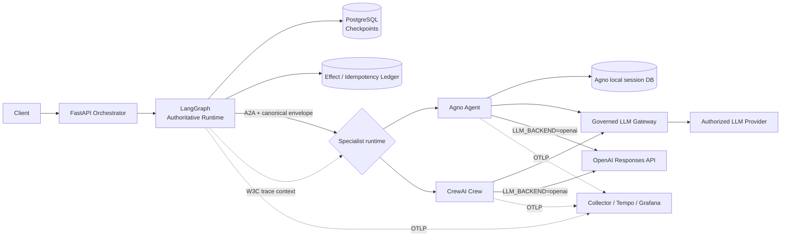

# Agent Runtime Boundaries Lab

**English** | [Português (Brasil)](README.pt-BR.md)

A reference implementation for a problem that appears quickly in real multi-agent systems:

> **How do you take useful capabilities from more than one agent framework without giving more than
> one runtime ownership of the same execution state?**

This repository compares **LangGraph + Agno** and **LangGraph + CrewAI** deliberately:

- **LangGraph** owns global workflow state, checkpoints, resumption and workflow phase.
- **Agno** can own only specialist-local agent/session context.
- **CrewAI** can coordinate bounded specialist roles/tasks inside a Crew.
- **A2A** is the explicit remote-agent message boundary.
- **a2a-otel-kit** supplies the OpenTelemetry lifecycle and W3C Trace Context propagation.
- **Governed LLM Gateway** keeps provider selection, credentials, resilience and model-governance
  policy outside agent code in the default backend. Optional direct OpenAI uses your own API key.
- **PostgreSQL** stores LangGraph checkpoints and a separate effect/idempotency ledger.

The goal is not to argue that this exact stack is always right. The goal is to make **state ownership,
identity, replay and runtime boundaries executable and inspectable**.

## Why this repository exists

“Take the best of each framework” is a reasonable engineering goal. The hidden cost is that a second
runtime can also bring a second definition of session, run, persistence, retry, streaming, memory,
error handling and state reconstruction.

This lab uses one rule:

> **One runtime coordinates. Other runtimes provide capabilities behind explicit contracts.**

That lets the application keep LangGraph's durable workflow semantics while swapping the
specialist implementation between Agno and CrewAI without asking either specialist runtime to become
the source of truth for the same business execution.

## Architecture



## What the lab proves

The important invariants are explicit in code:

1. `conversation_id` is application-owned. Adapters map it to LangGraph `thread_id` and Agno
   `session_id`.
2. `execution_id` identifies one orchestrator execution.
3. `delegation_id` identifies one orchestrator-to-specialist call.
4. Agno `run_id` derives from `delegation_id`; it is not the global workflow identity.
5. Neither the Agno nor CrewAI specialist contract can set the global workflow phase.
6. Delegations use stable idempotency keys.
7. A completed remote result is stored separately from LangGraph checkpoints.
8. A crash after the specialist responds can be retried without invoking that specialist twice.
9. Cross-runtime payloads use framework-neutral Pydantic contracts.
10. W3C trace context crosses the A2A HTTP boundary without making `trace_id` a business ID.
11. Backend selection is explicit. Gateway mode uses a consumer credential; direct OpenAI keeps
    the provider key in specialist secret configuration, outside framework serialization/telemetry.

## Three comparative experiments, plus failure demonstrations

### Failure demonstration: show the dual-ownership anti-pattern

A credential-free script simulates a process dying between two global-state writes:

```bash
python examples/dual_ownership_failure.py
```

Expected result:

```text
BROKEN: dual ownership
  LangGraph global phase: specialist_completed
  Agno global phase:      received
  divergent:              True
```

It is intentionally simple: the point is to expose the distributed-systems failure hidden by a
sequential `save_framework_a(); save_framework_b()` design.

### Experiment 1: deterministic framework-neutral baseline

```bash
uv sync --all-groups
uv run python -m agent_runtime_boundaries.entrypoints.demo
```

Expected shape:

```text
first execution: specialist_calls=1 phase=completed reused=False
retry:           specialist_calls=1 phase=completed reused=True
```

The second execution reuses the completed delegation stored by the ledger.

### Experiment 1b: real PostgreSQL + LangGraph crash/retry proof

```bash
docker compose up -d postgres
uv run pytest -m integration -q
```

The integration test uses a real `AsyncPostgresSaver`, a separate PostgreSQL effect ledger and an
injected crash after specialist completion. The retry must finish with `specialist.calls == 1`.

## Experiment 2: LangGraph + A2A + Agno

The existing specialist service uses Agno for a bounded agent with specialist-local session context.
LangGraph remains authoritative for workflow progress and replay.

## Experiment 3: LangGraph + A2A + CrewAI

A second specialist implementation uses a CrewAI `Crew` with two roles: a Risk Analyst followed by a
Compliance Reviewer. It receives and returns the **same framework-neutral contract** as the Agno
service. In this experiment CrewAI memory and cache are disabled so the comparison focuses on the
role/task collaboration model rather than adding another persistence authority.

```bash
set -a; source .env; set +a
uv run uvicorn agent_runtime_boundaries.entrypoints.crewai_specialist:app \
  --host 0.0.0.0 --port 8102
```

Then point the unchanged orchestrator at it:

```bash
export SPECIALIST_A2A_URL=http://127.0.0.1:8102/a2a
uv run uvicorn agent_runtime_boundaries.entrypoints.api:app \
  --host 0.0.0.0 --port 8000
```

The companion anti-pattern demonstrates why a CrewAI **Flow** should not mirror the same global state
machine while LangGraph is already authoritative:

```bash
make anti-pattern-crewai
```

See [`docs/EXPERIMENTS.md`](docs/EXPERIMENTS.md) for the side-by-side design.

## Full-stack mode: LangGraph + A2A + Agno or CrewAI + governed model execution

For the existing sibling checkouts and the prepared real `.env`, see the
[live inference runbook (Portuguese)](docs/REAL_INFERENCE.pt-BR.md), using gateway port 8000 and
orchestrator port 8003.

Full-stack mode is opt-in because it requires your running Governed LLM Gateway profile and model
provider path, or your own OpenAI key for direct inference.

### Optional: OpenAI directly, without gateway services

For either specialist, configure `.env`:

```dotenv
LLM_BACKEND=openai
OPENAI_API_KEY=your-openai-key
OPENAI_MODEL=gpt-4.1-mini
OPENAI_MAX_OUTPUT_TOKENS=2000
OPENAI_REQUEST_TIMEOUT_SECONDS=60
```

Skip gateway/PDP startup and start PostgreSQL, one specialist and the orchestrator as below.
Restart the specialist after changing the backend; `/health` reports `llm_backend`. Use new execution
IDs for a fresh inference because completed IDs still reuse the effect ledger's stored result.

This mode uses the official OpenAI Responses API with `store=false`, no SDK/framework retries and
no provider conversation state. It sends evidence directly to OpenAI and has no gateway/PDP policy,
audit, routing or fallback controls. Setting an OpenAI key alone leaves the default gateway mode
active. There is no automatic fallback between backends. See [ADR 0007](docs/adr/0007-optional-direct-openai.md)
and the [complete direct-mode runbook](docs/REAL_INFERENCE.pt-BR.md#alternativa-sem-gateway-openai-direto).

### 1. Configure and start local infrastructure

```bash
cp .env.example .env
# Edit GOV* values before starting the specialist.
docker compose up -d postgres otel-collector tempo grafana
```

### 2. Start Governed LLM Gateway

Use the current gateway 1.1.0 profile with native `POST /v1/generate`. Both specialist frameworks
use custom model bridges over `GatewayClient`; the SDK and contracts are pinned to gateway commit
`7d7e2e3840719acd257b1c25c19f8ce4a84592d8` in `pyproject.toml` and `uv.lock`.
`uv sync --all-groups` installs them from GitHub; no gateway source checkout is required.

The lab uses the gateway's canonical connection variables plus lab workload/context settings:

```dotenv
GOVERNED_LLM_GATEWAY_URL=http://127.0.0.1:8001
LLM_BACKEND=gateway
GOVERNED_LLM_GATEWAY_API_KEY=...
GOVERNED_LLM_GATEWAY_WORKLOAD=agent.orchestration
GOVERNED_LLM_GATEWAY_RISK_LEVEL=high
GOVERNED_LLM_GATEWAY_DATA_CLASSIFICATION=confidential
```

Use the base URL **without `/v1`**. The SDK appends `/v1/generate`, sends `X-Gateway-API-Key`,
and permits HTTPS or literal loopback HTTP. Configure the gateway on port 8001, or adjust the
orchestrator's port, because the gateway's personal-default profile and the lab orchestrator otherwise
both use port 8000. The credential's authenticated client binding must authorize the workload;
`agent.orchestration` is present in the current personal-default profile.

Risk (`low`, `medium`, `high`, `critical`) and classification (`public`, `internal`, `confidential`,
`restricted`) must be declared explicitly to match the actual evidence. The gateway reconciles them
with the authenticated binding. The lab defaults to 2000 output tokens, a 30-second provider timeout
and a 60-second SDK request timeout; `.env.example` exposes those limits. A provider timeout is per
attempt, while the SDK request timeout bounds transport waiting and can terminate a longer execution.

For an existing `.env`, remove `GOVERNED_LLM_GATEWAY_MODEL`, remove `/v1` from the URL and add the
workload/risk/classification settings above. Neither framework selects a provider/model/deployment or
retries a failed generation. These lab bridges support text only; unsupported tools/media/structured
output fail before inference, and partial/empty output fails the specialist call. The SDK aggregates
validated SSE internally. See [ADR 0006](docs/adr/0006-native-gateway-sdk.md).

### 3. Start one specialist runtime

Agno:

```bash
set -a; source .env; set +a
uv run uvicorn agent_runtime_boundaries.entrypoints.specialist:app \
  --host 0.0.0.0 --port 8101
```

CrewAI:

```bash
set -a; source .env; set +a
uv run uvicorn agent_runtime_boundaries.entrypoints.crewai_specialist:app \
  --host 0.0.0.0 --port 8102
export SPECIALIST_A2A_URL=http://127.0.0.1:8102/a2a
```

### 4. Start the LangGraph orchestrator

```bash
set -a; source .env; set +a
uv run uvicorn agent_runtime_boundaries.entrypoints.api:app \
  --host 0.0.0.0 --port 8000
```

### 5. Send a request

```bash
curl -sS http://127.0.0.1:8000/v1/reviews \
  -H 'content-type: application/json' \
  -d '{
    "conversation_id": "merchant-123",
    "prompt": "Review the merchant risk and summarize the decision factors.",
    "payload": {"merchant_tier": "growth", "chargeback_ratio": 0.012}
  }'
```

## Failure injection

Set:

```dotenv
FAIL_AFTER_SPECIALIST_ONCE=true
```

For an explicit retry demonstration, supply stable execution identities in both attempts:

```json
{
  "conversation_id": "merchant-123",
  "execution_id": "exec:failure-demo-1",
  "delegation_id": "deleg:failure-demo-1",
  "prompt": "Review merchant risk.",
  "payload": {"merchant_tier": "growth"}
}
```

The first request fails after the completed specialist response is recorded. The retry uses the same
idempotency key and must reuse that response rather than delegating again.

> **A checkpoint tells you where the workflow was. An effect ledger tells you what already happened.**

## Canonical identity mapping

| Application identity | LangGraph | Agno | CrewAI | Meaning |
| --- | --- | --- | --- | --- |
| `conversation_id` | `thread_id` | `session_id` | task context only | long-lived interaction |
| `execution_id` | execution correlation | metadata | task context only | one orchestrator execution |
| `delegation_id` | state field | `run_id` | task context/local result version | one invocation |
| `idempotency_key` | application state | application metadata | task context | replay protection |

The mapping is an adapter concern. The domain layer imports neither framework.

## State ownership

| State | Owner |
| --- | --- |
| global workflow phase | LangGraph/application |
| checkpoint history | LangGraph/PostgreSQL |
| delegation/effect completion | application ledger/PostgreSQL |
| specialist-local session state | Agno when that experiment is selected |
| long-term user/domain memory | separate explicit store if required |
| CrewAI role/task collaboration | CrewAI Crew when selected |
| provider routing / credentials | Governed LLM Gateway by default; specialist config in direct OpenAI mode |
| distributed trace context | W3C Trace Context / a2a-otel-kit |

See [`docs/COMPARISON.md`](docs/COMPARISON.md) and
[`docs/EXPERIMENTS.md`](docs/EXPERIMENTS.md) for the framework trade-offs and executable comparison.

## A2A scope

The example keeps the remote boundary deliberately small: one A2A v1-style `SendMessage` JSON-RPC
exchange carrying the canonical contract in a text part. It uses `a2a-otel-kit`'s protocol-neutral
W3C propagation helpers around that boundary.

This is a **reference subset**, not a claim that the FastAPI adapter implements the complete A2A
server surface (agent cards, task lifecycle, streaming, push notifications, discovery and all
bindings). A production system needing full protocol conformance should use the official A2A SDK and
wrap its client/request handler with the kit's dedicated adapters.

## Repository layout

```text
src/agent_runtime_boundaries/
├── domain/          # canonical IDs, contracts and workflow state
├── application/     # framework-neutral policies and ports
├── adapters/        # LangGraph, Agno, CrewAI, A2A, Postgres and observability
└── entrypoints/     # FastAPI services and deterministic demo

tests/
├── unit/
├── contract/
└── integration/

docs/
├── adr/
└── diagrams/
```

## Engineering harness baseline

The repository follows the service-profile discipline of
[`codex-python-engineering-harness`](https://github.com/brunovicco/codex-python-engineering-harness):
`src/` layout, strict typing, Pydantic settings, credential-free core tests, Ruff/Mypy/Pytest,
architecture checks, ADRs and CI.

The inspected harness baseline and equivalent bootstrap intent are recorded in
[`docs/HARNESS_BASELINE.md`](docs/HARNESS_BASELINE.md).

## Quality

```bash
make quality
```

The deterministic core has an 80% minimum coverage gate. Integration is separate by design:

```bash
make integration
```

CI contains both jobs. The integration job starts PostgreSQL and proves the crash/retry invariant.

## Source projects

- <https://github.com/brunovicco/codex-python-engineering-harness>
- <https://github.com/brunovicco/a2a-otel-kit>
- <https://github.com/brunovicco/governed-llm-gateway>
- <https://github.com/crewAIInc/crewAI>

Exact source commits inspected while creating the lab are listed in [`SOURCES.md`](SOURCES.md).
