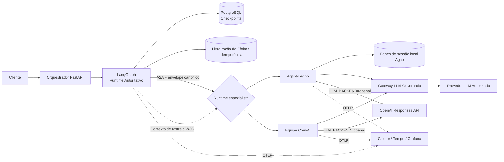

# Laboratório de Limites de Execução de Agentes (Agent Runtime Boundaries Lab)

[English](README.md) | **Português (Brasil)**

Uma implementação de referência para um problema que surge rapidamente em sistemas multi-agente reais:

> **Como você aproveita capacidades úteis de mais de um framework de agentes sem dar a mais de um runtime a propriedade do mesmo estado de execução?**

Este repositório compara deliberadamente **LangGraph + Agno** e **LangGraph + CrewAI**:

* O **LangGraph** gerencia o estado global do fluxo de trabalho, pontos de salvamento (*checkpoints*), retomada e fase do fluxo.
* O **Agno** gerencia apenas o contexto local de agente/sessão do especialista.
* O **CrewAI** pode coordenar papéis/tarefas de especialistas delimitados dentro de uma equipe (*Crew*).
* O **A2A** é o limite explícito de mensagens entre agentes remotos.
* O **a2a-otel-kit** fornece o ciclo de vida do OpenTelemetry e a propagação do contexto de rastreamento W3C (*W3C Trace Context*).
* O **Gateway LLM Governado** (*Governed LLM Gateway*) mantém a seleção de provedores, credenciais, resiliência e políticas de governança de modelos fora do código dos agentes no backend padrão. OpenAI direto é uma opção com chave própria.
* O **PostgreSQL** armazena os *checkpoints* do LangGraph e um registro (*ledger*) separado de efeitos/idempotência.

O objetivo não é afirmar que esta pilha exata está sempre correta. O objetivo é tornar **a propriedade de estado, identidade, repetição e limites de tempo de execução executáveis e inspecionáveis**.

---

## Por que este repositório existe

"Aproveitar o melhor de cada framework" é um objetivo de engenharia razoável. O custo oculto é que um segundo *runtime* também traz uma segunda definição de sessão, execução (*run*), persistência, nova tentativa (*retry*), transmissão (*streaming*), memória, tratamento de erros e reconstrução de estado.

Este laboratório utiliza uma única regra:

> **Um runtime coordena. Outros runtimes fornecem capacidades por trás de contratos explícitos.**

Isso permite que a aplicação mantenha a semântica de fluxo de trabalho durável do LangGraph enquanto alterna a implementação do especialista entre Agno e CrewAI, sem exigir que nenhum dos *runtimes* especialistas se torne a fonte da verdade para a mesma execução de negócio.

---

## Arquitetura



---

## O que o laboratório comprova

As invariantes importantes estão explícitas no código:

1. `conversation_id` pertence à aplicação. Os adaptadores o mapeiam para o `thread_id` do LangGraph e o `session_id` do Agno.
2. `execution_id` identifica uma execução do orquestrador.
3. `delegation_id` identifica uma chamada do orquestrador para o especialista.
4. O `run_id` do Agno deriva de `delegation_id`; ele não é a identidade global do fluxo de trabalho.
5. Nem o contrato do especialista Agno nem o do CrewAI podem definir a fase global do fluxo de trabalho.
6. As delegações usam chaves de idempotência estáveis.
7. Um resultado remoto concluído é armazenado separadamente dos *checkpoints* do LangGraph.
8. Uma falha após a resposta do especialista pode ser repetida (*retried*) sem invocar esse especialista duas vezes.
9. Cargas úteis (*payloads*) entre runtimes usam contratos Pydantic neutros em relação ao framework.
10. O contexto de rastreamento W3C cruza o limite HTTP A2A sem transformar o `trace_id` em um ID de negócio.
11. A seleção do backend é explícita. No modo gateway, o especialista recebe a credencial de consumidor; no modo OpenAI direto, a chave do provedor fica na configuração secreta do especialista, fora da serialização e telemetria.

---

## Três experimentos comparativos, mais demonstrações de falha

### Demonstração de falha: exibindo o antipadrão de dupla propriedade

Um script sem credenciais simula um processo que morre entre duas gravações de estado global:

```bash
python examples/dual_ownership_failure.py

```

Resultado esperado:

```text
BROKEN: dual ownership
  LangGraph global phase: specialist_completed
  Agno global phase:      received
  divergent:              True

```

É intencionalmente simples: o objetivo é expor a falha de sistemas distribuídos ocultada por um design sequencial do tipo `save_framework_a(); save_framework_b()`.

---

### Experimento 1: base determinística neutra em relação ao framework

```bash
uv sync --all-groups
uv run python -m agent_runtime_boundaries.entrypoints.demo

```

Formato esperado:

```text
first execution: specialist_calls=1 phase=completed reused=False
retry:           specialist_calls=1 phase=completed reused=True

```

A segunda execução reutiliza a delegação concluída armazenada pelo livro-razão (*ledger*).

---

### Experimento 1b: prova real de falha/retentativa com PostgreSQL + LangGraph

```bash
docker compose up -d postgres
uv run pytest -m integration -q

```

O teste de integração usa um `AsyncPostgresSaver` real, um registro de efeitos PostgreSQL separado e uma falha injetada após a conclusão do especialista. A nova tentativa deve terminar com `specialist.calls == 1`.

---

## Experimento 2: LangGraph + A2A + Agno

O serviço especialista existente usa o Agno para um agente delimitado com contexto de sessão local do especialista. O LangGraph continua sendo o autoritativo para o progresso e a retomada (*replay*) do fluxo de trabalho.

---

## Experimento 3: LangGraph + A2A + CrewAI

Uma segunda implementação de especialista usa uma equipe (*Crew*) do CrewAI com dois papéis: um Analista de Risco seguido por um Revisor de Conformidade. Ela recebe e retorna o **mesmo contrato neutro em relação ao framework** do serviço Agno. Neste experimento, a memória e o cache do CrewAI são desativados para que a comparação foque no modelo de colaboração de papéis/tarefas em vez de adicionar outra autoridade de persistência.

```bash
set -a; source .env; set +a
uv run uvicorn agent_runtime_boundaries.entrypoints.crewai_specialist:app \
  --host 0.0.0.0 --port 8102

```

Em seguida, aponte o orquestrador inalterado para ele:

```bash
export SPECIALIST_A2A_URL=http://127.0.0.1:8102/a2a
uv run uvicorn agent_runtime_boundaries.entrypoints.api:app \
  --host 0.0.0.0 --port 8000

```

O antipadrão complementar demonstra por que um **Fluxo** (*Flow*) do CrewAI não deve espelhar a mesma máquina de estados globais enquanto o LangGraph já é autoritativo:

```bash
make anti-pattern-crewai

```

Consulte [`docs/EXPERIMENTS.md`](docs/EXPERIMENTS.md) para ver o design lado a lado.

---

## Modo full-stack: LangGraph + A2A + Agno ou CrewAI + execução de modelo governada

Para testar com os checkouts locais e o `.env` real já preparado, siga o
[roteiro de inferência real](docs/REAL_INFERENCE.pt-BR.md), com gateway em 8000 e orquestrador em 8003.

O modo full-stack é opcional (*opt-in*) porque requer o seu perfil do gateway em execução ou sua chave OpenAI para inferência direta.

### Opção: OpenAI direto, sem serviços do gateway

Para Agno ou CrewAI, configure `.env`:

```dotenv
LLM_BACKEND=openai
OPENAI_API_KEY=sua-chave-openai
OPENAI_MODEL=gpt-4.1-mini
OPENAI_MAX_OUTPUT_TOKENS=2000
OPENAI_REQUEST_TIMEOUT_SECONDS=60
```

Pule a inicialização do gateway/PDP e inicie PostgreSQL, um especialista e o orquestrador.
Reinicie o especialista após alterar o backend; `/health` informa `llm_backend`.
Use novos IDs para exigir inferência: IDs concluídos continuam reutilizando o resultado do ledger.

Esse modo usa a OpenAI Responses API com `store=false`, sem retries do SDK/framework e sem estado
de conversa no provedor. As evidências vão diretamente para a OpenAI, sem política, auditoria,
roteamento ou fallback do gateway/PDP. Preencher a chave sem mudar `LLM_BACKEND` mantém o modo
gateway padrão. Não há fallback automático entre backends. Veja o [ADR 0007](docs/adr/0007-optional-direct-openai.md)
e a [sequência completa de comandos](docs/REAL_INFERENCE.pt-BR.md#alternativa-sem-gateway-openai-direto).

### 1. Configurar e iniciar a infraestrutura local

```bash
cp .env.example .env
# Edite os valores GOV* antes de iniciar o especialista.
docker compose up -d postgres otel-collector tempo grafana

```

### 2. Iniciar o Gateway LLM Governado

Use o perfil atual do gateway 1.1.0 com `POST /v1/generate`. Os dois frameworks usam adaptadores
customizados sobre `GatewayClient`; SDK e contratos estão fixados no commit
`7d7e2e3840719acd257b1c25c19f8ce4a84592d8` em `pyproject.toml` e `uv.lock`.
`uv sync --all-groups` instala esses pacotes pelo GitHub, sem exigir um checkout local do gateway.

Configure as variáveis canônicas de conexão e o contexto da chamada no laboratório:

```dotenv
GOVERNED_LLM_GATEWAY_URL=http://127.0.0.1:8001
LLM_BACKEND=gateway
GOVERNED_LLM_GATEWAY_API_KEY=...
GOVERNED_LLM_GATEWAY_WORKLOAD=agent.orchestration
GOVERNED_LLM_GATEWAY_RISK_LEVEL=high
GOVERNED_LLM_GATEWAY_DATA_CLASSIFICATION=confidential
```

A URL deve ser a base **sem `/v1`**. O SDK acrescenta `/v1/generate`, envia `X-Gateway-API-Key` e
aceita HTTPS ou HTTP em endereço literal de loopback. Configure o gateway na porta 8001, ou ajuste a
porta do orquestrador: o perfil personal-default do gateway e o orquestrador do lab usam 8000 por
padrão. O vínculo autenticado da credencial deve autorizar o workload; `agent.orchestration` está
presente no perfil personal-default atual.

Declare explicitamente o risco (`low`, `medium`, `high`, `critical`) e a classificação (`public`,
`internal`, `confidential`, `restricted`) apropriados às evidências. O gateway reconcilia essas
informações com o vínculo autenticado. O lab usa 2000 tokens de saída, timeout de 30 segundos por
tentativa do provedor e timeout de transporte do SDK de 60 segundos; `.env.example` expõe esses
limites. O timeout do SDK pode encerrar a espera por uma execução mais longa.

Para migrar um `.env` existente, remova `GOVERNED_LLM_GATEWAY_MODEL`, retire `/v1` da URL e adicione
workload, risco e classificação. Os frameworks não escolhem provedor/modelo/deployment nem repetem
uma geração que falhou. Os adaptadores do lab aceitam apenas texto: ferramentas, mídia e saída
estruturada são rejeitadas antes da inferência; saída parcial ou vazia causa falha do especialista.
O SDK agrega internamente o SSE validado. Veja o [ADR 0006](docs/adr/0006-native-gateway-sdk.md).

### 3. Iniciar um runtime especialista

Agno:

```bash
set -a; source .env; set +a
uv run uvicorn agent_runtime_boundaries.entrypoints.specialist:app \
  --host 0.0.0.0 --port 8101

```

CrewAI:

```bash
set -a; source .env; set +a
uv run uvicorn agent_runtime_boundaries.entrypoints.crewai_specialist:app \
  --host 0.0.0.0 --port 8102
export SPECIALIST_A2A_URL=http://127.0.0.1:8102/a2a

```

### 4. Iniciar o orquestrador LangGraph

```bash
set -a; source .env; set +a
uv run uvicorn agent_runtime_boundaries.entrypoints.api:app \
  --host 0.0.0.0 --port 8000

```

### 5. Enviar uma requisição

```bash
curl -sS http://127.0.0.1:8000/v1/reviews \
  -H 'content-type: application/json' \
  -d '{
    "conversation_id": "merchant-123",
    "prompt": "Review the merchant risk and summarize the decision factors.",
    "payload": {"merchant_tier": "growth", "chargeback_ratio": 0.012}
  }'

```

---

## Injeção de falhas

Defina:

```dotenv
FAIL_AFTER_SPECIALIST_ONCE=true

```

Para uma demonstração explícita de nova tentativa, forneça identidades de execução estáveis em ambas as tentativas:

```json
{
  "conversation_id": "merchant-123",
  "execution_id": "exec:failure-demo-1",
  "delegation_id": "deleg:failure-demo-1",
  "prompt": "Review merchant risk.",
  "payload": {"merchant_tier": "growth"}
}

```

A primeira requisição falha após a gravação da resposta concluída do especialista. A nova tentativa usa a mesma chave de idempotência e deve reutilizar essa resposta em vez de delegar novamente.

> **Um checkpoint diz onde o fluxo de trabalho estava. Um livro-razão de efeitos diz o que já aconteceu.**

---

## Mapeamento de identidade canônica

| Identidade da aplicação | LangGraph | Agno | CrewAI | Significado |
| --- | --- | --- | --- | --- |
| `conversation_id` | `thread_id` | `session_id` | apenas contexto de tarefa | interação de longa duração |
| `execution_id` | correlação de execução | metadados | apenas contexto de tarefa | uma execução do orquestrador |
| `delegation_id` | campo de estado | `run_id` | contexto de tarefa / versão do resultado local | uma invocação |
| `idempotency_key` | estado da aplicação | metadados da aplicação | contexto de tarefa | proteção contra repetição |

O mapeamento é uma preocupação do adaptador. A camada de domínio não importa nenhum dos frameworks.

---

## Propriedade de estado

| Estado | Proprietário |
| --- | --- |
| fase global do fluxo de trabalho | LangGraph / aplicação |
| histórico de checkpoints | LangGraph / PostgreSQL |
| conclusão de delegação/efeito | livro-razão da aplicação / PostgreSQL |
| estado de sessão local do especialista | Agno (quando esse experimento é selecionado) |
| memória de longo prazo do usuário/domínio | armazenamento explícito separado (se necessário) |
| colaboração de papel/tarefa do CrewAI | CrewAI Crew (quando selecionado) |
| roteamento de provedor / credenciais | Gateway LLM Governado por padrão; configuração do especialista em OpenAI direto |
| contexto de rastreamento distribuído | W3C Trace Context / a2a-otel-kit |

Consulte [`docs/COMPARISON.md`](docs/COMPARISON.md) e [`docs/EXPERIMENTS.md`](docs/EXPERIMENTS.md) para ver as vantagens/desvantagens dos frameworks e a comparação executável.

---

## Escopo A2A

O exemplo mantém o limite remoto propositalmente pequeno: uma troca JSON-RPC estilo A2A v1 `SendMessage` carregando o contrato canônico em uma parte de texto. Ele usa os auxiliares de propagação W3C neutros em protocolo do `a2a-otel-kit` ao redor desse limite.

Este é um **subconjunto de referência**, e não uma afirmação de que o adaptador FastAPI implementa a superfície completa do servidor A2A (cartões de agente, ciclo de vida de tarefas, streaming, notificações push, descoberta e todas as vinculações). Um sistema de produção que precise de conformidade total com o protocolo deve usar o SDK oficial do A2A e envolver seu manipulador de cliente/requisição com os adaptadores dedicados do kit.

---

## Estrutura do repositório

```text
src/agent_runtime_boundaries/
├── domain/          # IDs canônicos, contratos e estado do fluxo de trabalho
├── application/     # políticas e portas neutras em relação ao framework
├── adapters/        # LangGraph, Agno, CrewAI, A2A, Postgres e observabilidade
└── entrypoints/     # Serviços FastAPI e demonstração determinística

tests/
├── unit/
├── contract/
└── integration/

docs/
├── adr/
└── diagrams/

```

---

## Base de engenharia (*engineering harness*)

O repositório segue a disciplina de perfil de serviço do [`codex-python-engineering-harness`](https://github.com/brunovicco/codex-python-engineering-harness): layout `src/`, tipagem estrita, configurações Pydantic, testes centrais sem credenciais, Ruff/Mypy/Pytest, verificações de arquitetura, ADRs e CI.

A base de harness inspecionada e a intenção de inicialização equivalente estão registradas em [`docs/HARNESS_BASELINE.md`](docs/HARNESS_BASELINE.md).

---

## Qualidade

```bash
make quality

```

O núcleo determinístico possui um limite mínimo de cobertura de 80%. A integração é separada por design:

```bash
make integration

```

O CI contém ambos os jobs. O job de integração inicia o PostgreSQL e prova a invariante de falha/retentativa.

---

## Projetos de origem

* [https://github.com/brunovicco/codex-python-engineering-harness](https://github.com/brunovicco/codex-python-engineering-harness)
* [https://github.com/brunovicco/a2a-otel-kit](https://github.com/brunovicco/a2a-otel-kit)
* [https://github.com/brunovicco/governed-llm-gateway](https://github.com/brunovicco/governed-llm-gateway)
* [https://github.com/crewAIInc/crewAI](https://github.com/crewAIInc/crewAI)

Os commits exatos de origem inspecionados durante a criação do laboratório estão listados em [`SOURCES.md`](SOURCES.md).
