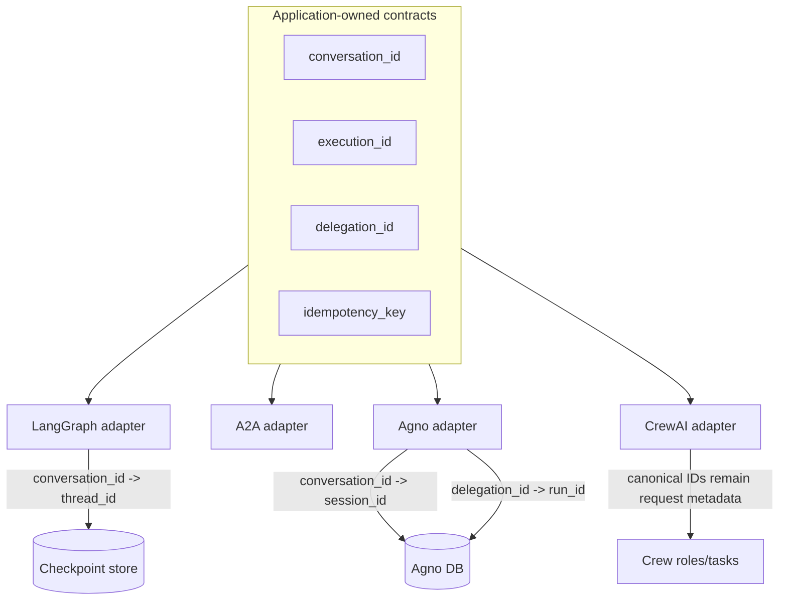
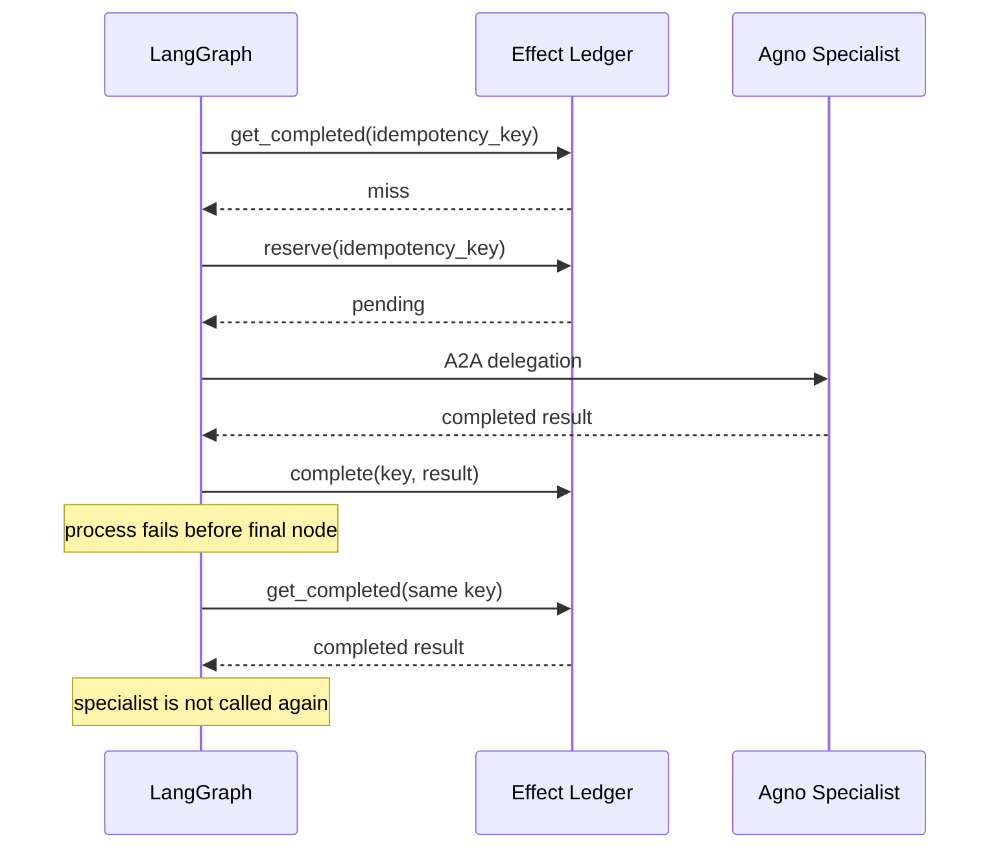

# Architecture

## Problem

Using multiple agent frameworks can be useful because each framework may offer a capability that is
stronger or more convenient for a specific part of a system. The architectural risk is accidentally
combining **authorities**, not just features.

This lab makes the following authorities explicit:

1. **Workflow authority** — LangGraph + the application domain.
2. **Specialist capability** — Agno Agent or CrewAI Crew, selected behind one contract.
3. **Specialist-local state** — Agno only when its experiment is selected; CrewAI memory is
   disabled in the comparison experiment.
4. **Model execution authority** — Governed LLM Gateway by default; explicit direct OpenAI is
   configured and called by the specialist.
5. **Telemetry correlation** — OpenTelemetry / W3C Trace Context through a2a-otel-kit.

## Canonical model

The domain layer never imports either framework.

## Why a separate effect ledger exists

LangGraph checkpoints and the effect ledger solve different problems.

A checkpoint can tell the orchestrator that it reached the specialist node. It cannot, by itself,
guarantee that a remote service was not already invoked before a process failure.

The ledger records a stable idempotency key and the completed response. On replay, the orchestrator
can reuse that response instead of invoking the remote specialist again. Before delegating, it also
`reserve`s the key, so a crash between the remote call and the completed write still leaves a
durable `pending` record — see [ADR 0008](adr/0008-ledger-pending-reservation.md). That reservation
makes the crash window auditable, not exactly-once: a retry that only finds a `pending` record still
invokes the specialist again, because the ledger cannot know whether the earlier remote call
actually succeeded.

Same flow as [`docs/diagrams/retry-sequence.mmd`](diagrams/retry-sequence.mmd).

## Why specialist runtimes do not own the global state

Agno session state remains valuable for data that belongs to the specialist. CrewAI Crews are
valuable for coordinating role/task collaboration, and CrewAI Flows can themselves orchestrate
stateful processes. None of those capabilities should become a second source of truth for global
phases such as `pending_approval`, `specialist_completed` or `completed` while LangGraph already
owns those phases. Otherwise recovery has to reconcile two state machines.

## Why A2A is a boundary, not another state store

A2A transports a task/message between independently deployed capabilities. The canonical envelope
still carries application identities and idempotency metadata. The protocol does not replace the
application's state model.

## Why Governed LLM Gateway sits behind specialist frameworks

The specialist needs a model, but it should not decide provider credentials, provider fallback or the
policy boundary. Agno and CrewAI use custom model bridges over the native `GatewayClient` SDK
and `POST /v1/generate`. They declare workload, risk and data classification; the gateway authenticates
and reconciles that context and owns provider selection and inference retries/fallback. Framework
retries are disabled. These specialist bridges support text only and fail on partial or empty output.
See [ADR 0006](adr/0006-native-gateway-sdk.md) for the gateway contract and lifecycle.

Both frameworks now use the same `TextGenerationClient` interface. `LLM_BACKEND=openai` selects
the direct OpenAI Responses adapter using secret `OPENAI_API_KEY` and explicit `OPENAI_MODEL`.
It does not require gateway services or policy declarations and has no gateway/PDP governance.
Neither SDK nor framework retries or changes backend on failure. Provider conversation state is
not used; the request specifies `store=false`. LangGraph, A2A contracts and the effect ledger keep
their ownership. Changing backend does not invalidate stored completed results: new IDs are required
for fresh inference. See [ADR 0007](adr/0007-optional-direct-openai.md).

## Observability

`a2a-otel-kit` configures the OTLP lifecycle and privacy-oriented telemetry boundary. W3C Trace Context
is propagated across the A2A HTTP call. The canonical IDs remain application fields; they do not
replace `trace_id` and `span_id`.

Do not put prompts, A2A bodies, credentials or full business payloads in span attributes.
